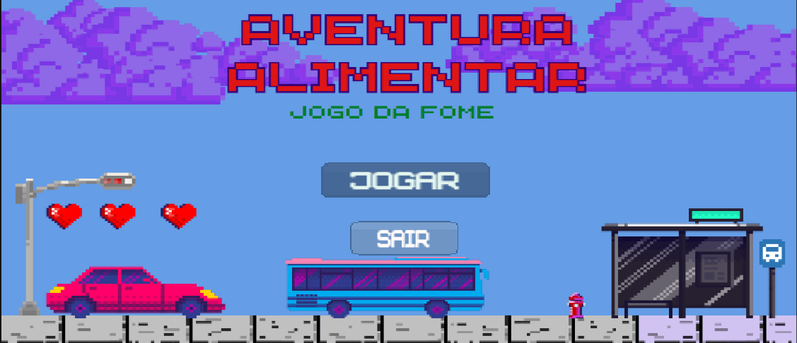

# FECAP - Fundação de Comércio Álvares Penteado

<p align="center">
<a href= "https://www.fecap.br/"></a>
</p>

# Aventura Alimentar:  O Jogo da Fome

## Nutri o futuro

## Integrantes: <a href="https://www.linkedin.com/in/victorbarq/">Fabricio Freitas Gomes</a>, <a href="https://www.linkedin.com/in/victorbarq/">Hellen Caroline Batista Silva</a>, <a href="https://www.linkedin.com/in/jenifer-barreto-55022523b/">Jenifer Barreto </a>, <a href="https://www.linkedin.com/in/victorbarq/">Maria Kassandra Alves Gomes</a>

## Professores Orientadores: <a href="https://www.linkedin.com/in/victorbarq/"> Victor Rosetti</a>, <a href="https://www.linkedin.com/in/victorbarq/"> Adriano F. Valente</a>, <a href="https://www.linkedin.com/in/victorbarq/"> Alexsandro Roberto</a>, <a href="https://www.linkedin.com/in/fabiano-on%C3%A7a-3214a12/"> Fabiano Onça</a>, <a href="https://www.linkedin.com/in/victorbarq/">Renata Muniz</a>

## Descrição

<p align="center">

  Game by <a href="http://www.nyphotographic.com/">Nick Youngson</a> <a rel="license" href="https://creativecommons.org/licenses/by-sa/3.0/">CC BY-SA 3.0</a> <a href="http://pix4free.org/">Pix4free</a>
</p>


O jogo foi baseado na ODS 2 – Fome zero
O propósito do jogo é conscientizar aqueles que não vivenciam situações como essa, permitindo-lhes entender melhor as experiências das pessoas nessas circunstâncias. Ao mesmo tempo, visa alcançar e orientar aqueles que podem estar enfrentando dificuldades, fornecendo informações sobre refúgio, alimentação e possíveis meios para superar esses desafios.
O jogo gráfico criado em plataforma 2D 
Engine Unity 
Desenvolvido para ser jogado em computadores
Linguagem C#

<br><br>

## 🛠 Estrutura de pastas

-Raiz<br>
|<br>
|-->documentos<br>
  &emsp;|-->antigos<br>
  &emsp;|GRUPO 02 - CCOMP - Projetos de Extensão.docx<br>
|-->executáveis<br>
  &emsp;|-->windows<br>
|-->imagens<br>
 &emsp;|-->MenuInicial.png<br>
|-->src<br>
  &emsp;|-->PI_ODS2v1.7<br>
|readme.md<br>

A pasta raiz contem dois arquivos que devem ser alterados:

<b>README.MD</b>: Arquivo que serve como guia e explicação geral sobre seu projeto. O mesmo que você está lendo agora.

Há também 4 pastas que seguem da seguinte forma:

<b>documentos</b>: Toda a documentação estará nesta pasta.

<b>executáveis</b>: Binários e executáveis do projeto devem estar nesta pasta.

<b>imagens</b>: Imagens do sistema

<b>src</b>: Pasta que contém o código fonte.

## 🛠 Instalação

<b>Android:</b>

Faça o Download do JOGO.apk no seu celular.
Execute o APK e siga as instruções de seu telefone.

```sh
Coloque código do prompt de comnando se for necessário
```

<b>Windows:</b>

Não há instalação! Apenas executável!
Encontre o JOGO.exe na pasta executáveis e execute-o como qualquer outro programa.

```sh
Coloque código do prompt de comnando se for necessário
```

<b>HTML:</b>

Não há instalação!
Encontre o index.html na pasta executáveis e execute-o como uma página WEB (através de algum browser).

## 💻 Configuração para Desenvolvimento

Descreva como instalar todas as dependências para desenvolvimento e como rodar um test-suite automatizado de algum tipo. Se necessário, faça isso para múltiplas plataformas.

Para abrir este projeto você necessita das seguintes ferramentas:

-<a href="https://godotengine.org/download">GODOT</a>

```sh
make install
npm test
Coloque código do prompt de comnando se for necessário
```

## 🗃 Histórico de lançamentos

A cada atualização os detalhes devem ser lançados aqui.

* 0.2.1 - 25/01/2022
    * MUDANÇA: Atualização de docs (código do módulo permanece inalterado)
* 0.2.0 - 15/01/2022
    * MUDANÇA: Remove `setDefaultXYZ()`
    * ADD: Adiciona `init()`
* 0.1.1 - 11/01/2022
    * CONSERTADO: Crash quando chama `baz()` (Obrigado @NomeDoContribuidorGeneroso!)
* 0.1.0 - 10/01/2022
    * O primeiro lançamento adequado
    * MUDANÇA: Renomeia `foo()` para `bar()`
* 0.0.1 - 01/01/2022
    * Trabalho em andamento

## 📋 Licença/License


## 🎓 Referências

Aqui estão as referências usadas no projeto.

1. <https://github.com/iuricode/readme-template>
2. <https://github.com/gabrieldejesus/readme-model>
3. <https://creativecommons.org/share-your-work/>
4. <https://freesound.org/>
5. Músicas por: <a href="https://freesound.org/people/DaveJf/sounds/616544/"> DaveJf </a> e <a href="https://freesound.org/people/DRFX/sounds/338986/"> DRFX </a> ambas com Licença CC 0.
